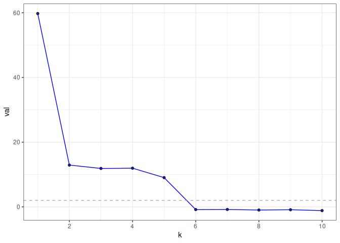

<!-- README.md is generated from README.Rmd. Please edit that file -->

# gdim

<!-- badges: start -->

[](https://github.com/RoheLab/gdim/actions/workflows/R-CMD-check.yaml)
[](https://app.codecov.io/gh/RoheLab/gdim?branch=master)
<!-- badges: end -->

`gdim` estimates graph dimension using cross-validated eigenvalues, via
the graph-splitting technique developed in
<http://arxiv.org/abs/2108.03336>. Theoretically, the method works by
computing a special type of cross-validated eigenvalue which follows a
simple central limit theorem. This allows users to perform hypothesis
tests on the rank of the graph.

## Installation

You can install `gdim` from [GitHub](https://github.com/) with:

``` r
# install.packages("devtools")
devtools::install_github("RoheLab/gdim")
```

## Example

`eigcv()` is the main function in `gdim`. The single required parameter
for the function is the maximum possible dimension, `k_max`.

In the following example, we generate a random graph from the stochastic
block model (SBM) with 1000 nodes and 5 blocks (as such, we would expect
the estimated graph dimension to be 5).

``` r
library(fastRG)
#> Loading required package: Matrix

B <- matrix(0.1, 5, 5)
diag(B) <- 0.3

model <- sbm(
  n = 1000,
  k = 5,
  B = B,
  expected_degree = 40,
  poisson_edges = FALSE,
  allow_self_loops = FALSE
)

A <- sample_sparse(model)
```

Here, `A` is the adjacency matrix.

Now, we call the `eigcv()` function with `k_max=10` to estimate graph
dimension.

``` r
library(gdim)

eigcv_result <- eigcv(A, k_max = 10)
eigcv_result
#> Estimated graph dimension:    5
#> 
#> Number of bootstraps:         10
#> Edge splitting probabaility:  0.1
#> Significance level:       0.05
#> 
#>  ------------ Summary of Tests ------------
#>   k         z        pvals         padj
#>   1 60.714642 1.000000e-32 1.000000e-32
#>   2 12.151329 1.000000e-32 1.000000e-32
#>   3 12.750212 1.000000e-32 1.000000e-32
#>   4 12.571384 1.000000e-32 1.000000e-32
#>   5 11.184326 2.432946e-29 2.432946e-29
#>   6 -1.359304 9.129749e-01 9.129749e-01
#>   7 -1.321162 9.067763e-01 9.067763e-01
#>   8 -1.897079 9.710912e-01 9.710912e-01
#>   9 -1.221527 8.890568e-01 8.890568e-01
#>  10 -1.619458 9.473256e-01 9.473256e-01
```

In this example, `eigcv()` suggests `k=5`.

To visualize the result, use `plot()` which returns a `ggplot` object.
The function displays the test statistic (z score) for each hypothesized
graph dimension.

``` r
plot(eigcv_result)
```



## Reference

Chen, Fan, Sebastien Roch, Karl Rohe, and Shuqi Yu. “Estimating Graph
Dimension with Cross-Validated Eigenvalues.” ArXiv:2108.03336 \[Cs,
Math, Stat\], August 6, 2021. <http://arxiv.org/abs/2108.03336>.
